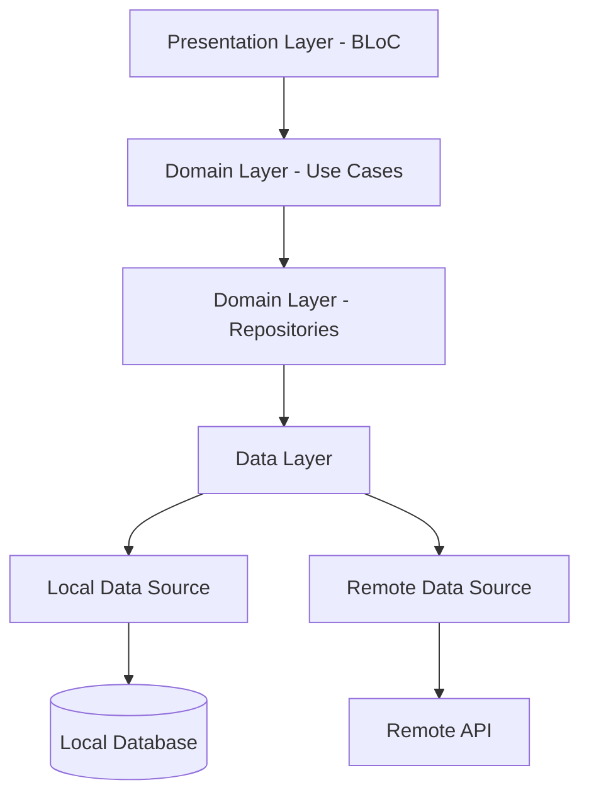

# Money Manager App - Technical Architecture Implementation Plan

## 1. Technology Stack

### 1.1 Core Framework & Languages
- **Framework**: Flutter 3.16+
- **Language**: Dart 3.2+
- **State Management**: BLoC (Business Logic Component) Pattern
- **Dependency Injection**: GetIt 7.6+
- **Navigation**: Go Router 13.0+
- **Local Database**: Drift (based on SQLite)
- **HTTP Client**: Dio 5.3+
- **Image Processing**: image package
- **Animations**: Rive & Lottie for advanced animations
- **Charts**: fl_chart for financial visualizations

### 1.2 Additional Dependencies
```yaml
dependencies:
  flutter:
    sdk: flutter

  # State Management & DI
  flutter_bloc: ^8.1.4
  bloc: ^8.1.3
  get_it: ^7.6.4
  injectable: ^2.3.2

  # Navigation
  go_router: ^13.0.1

  # Database
  drift: ^2.16.0
  sqlite3_flutter_libs: ^0.5.20
  path_provider: ^2.1.2
  path: ^1.9.0

  # Network
  dio: ^5.3.4
  retrofit: ^4.0.3
  json_annotation: ^4.8.1

  # UI & Animations
  flutter_screenutil: ^5.9.0
  rive: ^0.13.1
  lottie: ^2.7.0
  flutter_staggered_animations: ^1.1.1
  google_fonts: ^6.1.0

  # Utilities
  equatable: ^2.0.5
  freezed: ^2.4.6
  freezed_annotation: ^2.4.1
  logger: ^2.0.2+1
  uuid: ^4.2.1

  # Financial & Charts
  fl_chart: ^0.65.0

  # Image & Camera
  image_picker: ^1.0.7
  camera: ^0.10.5+5

  # Security
  flutter_secure_storage: ^9.0.0

  # Notifications
  flutter_local_notifications: ^16.3.2

  # Permissions
  permission_handler: ^11.1.0

dev_dependencies:
  flutter_test:
    sdk: flutter
  flutter_lints: ^3.0.1

  # Code Generation
  build_runner: ^2.4.7
  retrofit_generator: ^8.0.4
  json_serializable: ^6.7.1
  injectable_generator: ^2.4.1
  drift_dev: ^2.16.0
  custom_lint: ^0.5.7
  very_good_analysis: ^5.1.0
```

## 2. Project Structure

```
money_manager/
├── lib/
│   ├── main.dart
│   ├── app/
│   │   ├── app.dart
│   │   ├── router/
│   │   │   ├── app_router.dart
│   │   │   └── route_names.dart
│   │   ├── theme/
│   │   │   ├── app_theme.dart
│   │   │   ├── light_theme.dart
│   │   │   ├── dark_theme.dart
│   │   │   └── text_styles.dart
│   │   ├── constants/
│   │   │   ├── app_constants.dart
│   │   │   ├── api_constants.dart
│   │   │   ├── asset_constants.dart
│   │   │   └── animation_constants.dart
│   │   └── extensions/
│   │       ├── context_extensions.dart
│   │       ├── string_extensions.dart
│   │       └── date_extensions.dart
│   ├── core/
│   │   ├── di/
│   │   │   ├── injection_container.dart
│   │   │   └── injection_modules.dart
│   │   ├── errors/
│   │   │   ├── exceptions.dart
│   │   │   ├── failures.dart
│   │   │   └── network_exceptions.dart
│   │   ├── network/
│   │   │   ├── dio_client.dart
│   │   │   ├── network_info.dart
│   │   │   └── interceptors/
│   │   ├── storage/
│   │   │   ├── secure_storage.dart
│   │   │   ├── shared_preferences_helper.dart
│   │   │   └── local_storage.dart
│   │   ├── utils/
│   │   │   ├── date_utils.dart
│   │   │   ├── currency_utils.dart
│   │   │   ├── form_validation.dart
│   │   │   └── animation_utils.dart
│   │   └── mixins/
│   │       ├── animation_mixin.dart
│   │       └── loading_mixin.dart
│   ├── features/
│   │   ├── authentication/
│   │   │   ├── data/
│   │   │   │   ├── models/
│   │   │   │   │   ├── user_model.dart
│   │   │   │   │   └── auth_response_model.dart
│   │   │   │   ├── datasources/
│   │   │   │   │   ├── auth_local_datasource.dart
│   │   │   │   │   └── auth_remote_datasource.dart
│   │   │   │   └── repositories/
│   │   │   │       └── auth_repository_impl.dart
│   │   │   ├── domain/
│   │   │   │   ├── entities/
│   │   │   │   │   ├── user.dart
│   │   │   │   │   └── auth_response.dart
│   │   │   │   ├── repositories/
│   │   │   │   │   └── auth_repository.dart
│   │   │   │   └── usecases/
│   │   │   │       ├── login_usecase.dart
│   │   │   │       ├── register_usecase.dart
│   │   │   │       └── logout_usecase.dart
│   │   │   ├── presentation/
│   │   │   │   ├── bloc/
│   │   │   │   │   ├── auth_bloc.dart
│   │   │   │   │   ├── auth_event.dart
│   │   │   │   │   ├── auth_state.dart
│   │   │   │   │   ├── login_bloc.dart
│   │   │   │   │   ├── login_event.dart
│   │   │   │   │   └── login_state.dart
│   │   │   │   ├── pages/
│   │   │   │   │   ├── login_page.dart
│   │   │   │   │   ├── register_page.dart
│   │   │   │   │   └── forgot_password_page.dart
│   │   │   │   └── widgets/
│   │   │   │       ├── login_form.dart
│   │   │   │       ├── register_form.dart
│   │   │   │       └── social_login_buttons.dart
│   │   ├── transactions/
│   │   │   ├── data/
│   │   │   │   ├── models/
│   │   │   │   │   ├── transaction_model.dart
│   │   │   │   │   ├── category_model.dart
│   │   │   │   │   └── account_model.dart
│   │   │   │   ├── datasources/
│   │   │   │   │   ├── transaction_local_datasource.dart
│   │   │   │   │   └── transaction_remote_datasource.dart
│   │   │   │   └── repositories/
│   │   │   │       └── transaction_repository_impl.dart
│   │   │   ├── domain/
│   │   │   │   ├── entities/
│   │   │   │   │   ├── transaction.dart
│   │   │   │   │   ├── category.dart
│   │   │   │   │   └── account.dart
│   │   │   │   ├── repositories/
│   │   │   │   │   └── transaction_repository.dart
│   │   │   │   └── usecases/
│   │   │   │       ├── add_transaction_usecase.dart
│   │   │   │       ├── get_transactions_usecase.dart
│   │   │   │       ├── update_transaction_usecase.dart
│   │   │   │       └── delete_transaction_usecase.dart
│   │   │   ├── presentation/
│   │   │   │   ├── bloc/
│   │   │   │   │   ├── transaction_bloc.dart
│   │   │   │   │   ├── transaction_event.dart
│   │   │   │   │   ├── transaction_state.dart
│   │   │   │   │   ├── add_transaction_bloc.dart
│   │   │   │   │   ├── add_transaction_event.dart
│   │   │   │   │   └── add_transaction_state.dart
│   │   │   │   ├── pages/
│   │   │   │   │   ├── transactions_page.dart
│   │   │   │   │   ├── add_transaction_page.dart
│   │   │   │   │   └── transaction_details_page.dart
│   │   │   │   └── widgets/
│   │   │   │       ├── transaction_list.dart
│   │   │   │       ├── transaction_card.dart
│   │   │   │       ├── category_selector.dart
│   │   │   │       └── amount_input.dart
│   │   ├── budget/
│   │   ├── analytics/
│   │   ├── goals/
│   │   └── settings/
│   ├── shared/
│   │   ├── widgets/
│   │   │   ├── common/
│   │   │   │   ├── custom_button.dart
│   │   │   │   ├── custom_text_field.dart
│   │   │   │   ├── loading_widget.dart
│   │   │   │   ├── error_widget.dart
│   │   │   │   └── empty_state_widget.dart
│   │   │   ├── animated/
│   │   │   │   ├── animated_container.dart
│   │   │   │   ├── slide_animation.dart
│   │   │   │   ├── fade_animation.dart
│   │   │   │   └── scale_animation.dart
│   │   │   └── charts/
│   │   │       ├── line_chart.dart
│   │   │       ├── bar_chart.dart
│   │   │       ├── pie_chart.dart
│   │   │       └── custom_chart_widget.dart
│   │   ├── providers/
│   │   │   ├── theme_provider.dart
│   │   │   ├── locale_provider.dart
│   │   │   └── user_provider.dart
│   │   └── constants/
│   │       ├── colors.dart
│   │       ├── dimensions.dart
│   │       ├── strings.dart
│   │       └── animations.dart
│   └── database/
│       ├── app_database.dart
│       ├── tables/
│       │   ├── users_table.dart
│       │   ├── transactions_table.dart
│       │   ├── categories_table.dart
│       │   ├── accounts_table.dart
│       │   ├── budgets_table.dart
│       │   └── goals_table.dart
│       └── daos/
│           ├── user_dao.dart
│           ├── transaction_dao.dart
│           ├── category_dao.dart
│           ├── account_dao.dart
│           ├── budget_dao.dart
│           └── goal_dao.dart
├── assets/
│   ├── images/
│   ├── icons/
│   ├── animations/
│   │   ├── rive/
│   │   └── lottie/
│   └── fonts/
├── test/
│   ├── unit/
│   ├── widget/
│   └── integration/
└── pubspec.yaml
```

## 3. Architecture Patterns

### 3.1 Clean Architecture with BLoC



### 3.2 Dependency Injection Structure with GetIt

```dart
// core/di/injection_container.dart
final GetIt getIt = GetIt.instance;

@InjectableInit(
  initializerName: 'initDependencies',
  preferRelativeImports: true,
  asExtension: true,
)
Future<void> configureDependencies() async {
  await getIt.initDependencies();
}

// core/di/injection_modules.dart
@module
abstract class RegisterModule {
  @lazySingleton
  Dio get dio => DioClient.instance;

  @lazySingleton
  NetworkInfo get networkInfo => NetworkInfoImpl();

  @lazySingleton
  SecureStorage get secureStorage => SecureStorageImpl();

  @lazySingleton
  AppDatabase get database => AppDatabase();

  // Repositories
  @lazySingleton
  AuthRepository get authRepository => AuthRepositoryImpl();

  @lazySingleton
  TransactionRepository get transactionRepository => TransactionRepositoryImpl();

  // Use Cases
  @factoryMethod
  LoginUseCase getLoginUseCase(AuthRepository repository) =>
    LoginUseCase(repository);

  @factoryMethod
  AddTransactionUseCase getAddTransactionUseCase(TransactionRepository repository) =>
    AddTransactionUseCase(repository);
}
```

## 4. Go Router Configuration

### 4.1 Router Setup

```dart
// app/router/app_router.dart
@immutable
class AppRouter {
  final GoRouter router = GoRouter(
    initialLocation: '/splash',
    debugLogDiagnostics: kDebugMode,
    redirect: (context, state) {
      final authBloc = context.read<AuthBloc>();
      final isAuthenticated = authBloc.state is AuthAuthenticated;

      final isAuthRoute = state.location.startsWith('/auth');
      final isSplashRoute = state.location == '/splash';

      if (isSplashRoute) return null;

      if (!isAuthenticated && !isAuthRoute) {
        return '/auth/login';
      }

      if (isAuthenticated && isAuthRoute) {
        return '/dashboard';
      }

      return null;
    },
    routes: [
      GoRoute(
        path: '/splash',
        name: 'splash',
        builder: (context, state) => const SplashPage(),
      ),
      GoRoute(
        path: '/auth',
        name: 'auth',
        builder: (context, state) => const AuthShell(),
        routes: [
          GoRoute(
            path: '/login',
            name: 'login',
            builder: (context, state) => const LoginPage(),
          ),
          GoRoute(
            path: '/register',
            name: 'register',
            builder: (context, state) => const RegisterPage(),
          ),
          GoRoute(
            path: '/forgot-password',
            name: 'forgot_password',
            builder: (context, state) => const ForgotPasswordPage(),
          ),
        ],
      ),
      ShellRoute(
        builder: (context, state, child) => MainShell(child: child),
        routes: [
          GoRoute(
            path: '/dashboard',
            name: 'dashboard',
            builder: (context, state) => const DashboardPage(),
          ),
          GoRoute(
            path: '/transactions',
            name: 'transactions',
            builder: (context, state) => const TransactionsPage(),
            routes: [
              GoRoute(
                path: '/add',
                name: 'add_transaction',
                builder: (context, state) => const AddTransactionPage(),
              ),
              GoRoute(
                path: '/:id',
                name: 'transaction_details',
                builder: (context, state) => TransactionDetailsPage(
                  transactionId: state.pathParameters['id']!,
                ),
              ),
            ],
          ),
          GoRoute(
            path: '/budget',
            name: 'budget',
            builder: (context, state) => const BudgetPage(),
          ),
          GoRoute(
            path: '/analytics',
            name: 'analytics',
            builder: (context, state) => const AnalyticsPage(),
          ),
          GoRoute(
            path: '/goals',
            name: 'goals',
            builder: (context, state) => const GoalsPage(),
          ),
          GoRoute(
            path: '/settings',
            name: 'settings',
            builder: (context, state) => const SettingsPage(),
          ),
        ],
      ),
    ],
    errorBuilder: (context, state) => ErrorPage(error: state.error),
  );
}
```

### 4.2 Animated Route Transitions

```dart
// app/router/page_transitions.dart
class CustomPageTransition {
  static Page<dynamic> slideTransition<T>({
    required LocalKey key,
    required Widget child,
    required Duration duration,
    SlideDirection direction = SlideDirection.left,
  }) {
    return CustomTransitionPage<T>(
      key: key,
      child: child,
      transitionsBuilder: (context, animation, secondaryAnimation, child) {
        const begin = Offset(1.0, 0.0);
        const end = Offset.zero;
        const curve = Curves.easeInOut;

        final tween = Tween(begin: begin, end: end).chain(
          CurveTween(curve: curve),
        );

        return SlideTransition(
          position: animation.drive(tween),
          child: child,
        );
      },
      transitionDuration: duration,
    );
  }

  static Page<dynamic> fadeTransition<T>({
    required LocalKey key,
    required Widget child,
    Duration duration = const Duration(milliseconds: 300),
  }) {
    return CustomTransitionPage<T>(
      key: key,
      child: child,
      transitionsBuilder: (context, animation, secondaryAnimation, child) {
        return FadeTransition(
          opacity: animation,
          child: child,
        );
      },
      transitionDuration: duration,
    );
  }
}
```

## 5. BLoC Implementation

### 5.1 Transaction BLoC Example

```dart
// features/transactions/presentation/bloc/transaction_bloc.dart
part 'transaction_event.dart';
part 'transaction_state.dart';

class TransactionBloc extends Bloc<TransactionEvent, TransactionState> {
  final GetTransactionsUseCase _getTransactionsUseCase;
  final DeleteTransactionUseCase _deleteTransactionUseCase;

  TransactionBloc({
    required GetTransactionsUseCase getTransactionsUseCase,
    required DeleteTransactionUseCase deleteTransactionUseCase,
  })  : _getTransactionsUseCase = getTransactionsUseCase,
        _deleteTransactionUseCase = deleteTransactionUseCase,
        super(const TransactionState.initial()) {
    on<TransactionEvent>(_onTransactionEvent);
  }

  Future<void> _onTransactionEvent(
    TransactionEvent event,
    Emitter<TransactionState> emit,
  ) async {
    return switch (event) {
      GetTransactions() => _onGetTransactions(emit),
      DeleteTransaction(transactionId: final id) =>
        _onDeleteTransaction(id, emit),
      FilterTransactions(filter: final filter) =>
        _onFilterTransactions(filter, emit),
      SearchTransactions(query: final query) =>
        _onSearchTransactions(query, emit),
    };
  }

  Future<void> _onGetTransactions(Emitter<TransactionState> emit) async {
    emit(const TransactionState.loading());

    final result = await _getTransactionsUseCase(NoParams());

    result.fold(
      (failure) => emit(TransactionState.error(failure.message)),
      (transactions) => emit(TransactionState.loaded(transactions)),
    );
  }

  Future<void> _onDeleteTransaction(String id, Emitter<TransactionState> emit) async {
    final result = await _deleteTransactionUseCase(DeleteTransactionParams(id));

    result.fold(
      (failure) => emit(TransactionState.error(failure.message)),
      (_) {
        add(GetTransactions());
      },
    );
  }

  void _onFilterTransactions(TransactionFilter filter, Emitter<TransactionState> emit) {
    if (state is TransactionLoaded) {
      final transactions = (state as TransactionLoaded).transactions;
      final filteredTransactions = transactions.where((transaction) {
        // Apply filter logic
        return true; // Simplified for example
      }).toList();

      emit(TransactionState.filtered(filteredTransactions));
    }
  }

  void _onSearchTransactions(String query, Emitter<TransactionState> emit) {
    if (state is TransactionLoaded) {
      final transactions = (state as TransactionLoaded).transactions;
      final searchResults = transactions.where((transaction) {
        return transaction.description.toLowerCase().contains(query.toLowerCase()) ||
               transaction.category.name.toLowerCase().contains(query.toLowerCase());
      }).toList();

      emit(TransactionState.filtered(searchResults));
    }
  }
}

@freezed
class TransactionEvent with _$TransactionEvent {
  const factory TransactionEvent.getTransactions() = GetTransactions;
  const factory TransactionEvent.deleteTransaction(String transactionId) =
    DeleteTransaction;
  const factory TransactionEvent.filterTransactions(TransactionFilter filter) =
    FilterTransactions;
  const factory TransactionEvent.searchTransactions(String query) =
    SearchTransactions;
}

@freezed
class TransactionState with _$TransactionState {
  const factory TransactionState.initial() = _Initial;
  const factory TransactionState.loading() = _Loading;
  const factory TransactionState.loaded(List<Transaction> transactions) = _Loaded;
  const factory TransactionState.filtered(List<Transaction> transactions) = _Filtered;
  const factory TransactionState.error(String message) = _Error;
}
```

## 6. Animation-Friendly UI Components

### 6.1 Custom Animated Container

```dart
// shared/widgets/animated/animated_container.dart
class AnimatedCardContainer extends StatefulWidget {
  final Widget child;
  final Duration duration;
  final Curve curve;
  final Color? color;
  final double? width;
  final double? height;
  final EdgeInsetsGeometry? margin;
  final EdgeInsetsGeometry? padding;
  final BorderRadius? borderRadius;
  final BoxShadow? boxShadow;
  final VoidCallback? onTap;

  const AnimatedCardContainer({
    Key? key,
    required this.child,
    this.duration = const Duration(milliseconds: 300),
    this.curve = Curves.easeInOut,
    this.color,
    this.width,
    this.height,
    this.margin,
    this.padding,
    this.borderRadius,
    this.boxShadow,
    this.onTap,
  }) : super(key: key);

  @override
  State<AnimatedCardContainer> createState() => _AnimatedCardContainerState();
}

class _AnimatedCardContainerState extends State<AnimatedCardContainer>
    with SingleTickerProviderStateMixin {
  late AnimationController _animationController;
  late Animation<double> _scaleAnimation;
  late Animation<double> _opacityAnimation;

  @override
  void initState() {
    super.initState();
    _animationController = AnimationController(
      duration: widget.duration,
      vsync: this,
    );

    _scaleAnimation = Tween<double>(
      begin: 1.0,
      end: 0.95,
    ).animate(CurvedAnimation(
      parent: _animationController,
      curve: widget.curve,
    ));

    _opacityAnimation = Tween<double>(
      begin: 1.0,
      end: 0.8,
    ).animate(CurvedAnimation(
      parent: _animationController,
      curve: widget.curve,
    ));
  }

  @override
  Widget build(BuildContext context) {
    return GestureDetector(
      onTapDown: (_) => _animationController.forward(),
      onTapUp: (_) => _animationController.reverse(),
      onTapCancel: () => _animationController.reverse(),
      onTap: widget.onTap,
      child: AnimatedBuilder(
        animation: _animationController,
        builder: (context, child) {
          return Transform.scale(
            scale: _scaleAnimation.value,
            child: Opacity(
              opacity: _opacityAnimation.value,
              child: AnimatedContainer(
                duration: widget.duration,
                curve: widget.curve,
                width: widget.width,
                height: widget.height,
                margin: widget.margin,
                padding: widget.padding,
                decoration: BoxDecoration(
                  color: widget.color ?? Theme.of(context).cardColor,
                  borderRadius: widget.borderRadius ?? BorderRadius.circular(12),
                  boxShadow: [
                    widget.boxShadow ??
                      BoxShadow(
                        color: Colors.black.withOpacity(0.1),
                        blurRadius: 8,
                        offset: const Offset(0, 2),
                      ),
                  ],
                ),
                child: widget.child,
              ),
            ),
          );
        },
      ),
    );
  }

  @override
  void dispose() {
    _animationController.dispose();
    super.dispose();
  }
}
```

### 6.2 Staggered List Animation

```dart
// shared/widgets/animated/animated_list.dart
class AnimatedTransactionList extends StatelessWidget {
  final List<Transaction> transactions;
  final Widget Function(BuildContext context, Transaction transaction, int index) itemBuilder;
  final Duration duration;
  final double verticalOffset;

  const AnimatedTransactionList({
    Key? key,
    required this.transactions,
    required this.itemBuilder,
    this.duration = const Duration(milliseconds: 375),
    this.verticalOffset = 50.0,
  }) : super(key: key);

  @override
  Widget build(BuildContext context) {
    return ListView.separated(
      padding: const EdgeInsets.all(16),
      itemCount: transactions.length,
      separatorBuilder: (context, index) => const SizedBox(height: 8),
      itemBuilder: (context, index) {
        return AnimationConfiguration.staggeredList(
          position: index,
          duration: duration,
          child: SlideAnimation(
            verticalOffset: verticalOffset,
            child: FadeInAnimation(
              child: itemBuilder(context, transactions[index], index),
            ),
          ),
        );
      },
    );
  }
}
```

### 6.3 Rive Animation Integration

```dart
// shared/widgets/animated/rive_animation_widget.dart
class RiveAnimationWidget extends StatefulWidget {
  final String animationPath;
  final String? animationName;
  final double? width;
  final double? height;
  final bool autoplay;
  final bool loop;

  const RiveAnimationWidget({
    Key? key,
    required this.animationPath,
    this.animationName,
    this.width,
    this.height,
    this.autoplay = true,
    this.loop = true,
  }) : super(key: key);

  @override
  State<RiveAnimationWidget> createState() => _RiveAnimationWidgetState();
}

class _RiveAnimationWidgetState extends State<RiveAnimationWidget> {
  Artboard? _riveArtboard;
  StateMachineController? _controller;

  @override
  void initState() {
    super.initState();
    _loadRiveAnimation();
  }

  Future<void> _loadRiveAnimation() async {
    final file = await RiveFile.asset(widget.animationPath);
    final artboard = file.mainArtboard;

    if (widget.animationName != null) {
      final controller = StateMachineController.fromArtboard(
        artboard,
        widget.animationName!,
      );

      if (controller != null) {
        artboard.addController(controller);
        setState(() {
          _riveArtboard = artboard;
          _controller = controller;
        });
      }
    } else {
      setState(() {
        _riveArtboard = artboard;
      });
    }
  }

  @override
  Widget build(BuildContext context) {
    if (_riveArtboard == null) {
      return const SizedBox.shrink();
    }

    return SizedBox(
      width: widget.width,
      height: widget.height,
      child: Rive(
        artboard: _riveArtboard!,
        autoplay: widget.autoplay,
        loop: widget.loop,
      ),
    );
  }

  @override
  void dispose() {
    _controller?.dispose();
    super.dispose();
  }
}
```

## 7. Responsive Design Implementation

### 7.1 ScreenUtil Integration

```dart
// app/constants/dimensions.dart
class AppDimensions {
  // Initialize ScreenUtil in main.dart
  static void init(BuildContext context) {
    ScreenUtil.init(context, designSize: const Size(375, 812));
  }

  // Margins
  static double get marginXS => 4.w;
  static double get marginS => 8.w;
  static double get marginM => 16.w;
  static double get marginL => 24.w;
  static double get marginXL => 32.w;

  // Paddings
  static double get paddingXS => 4.w;
  static double get paddingS => 8.w;
  static double get paddingM => 16.w;
  static double get paddingL => 24.w;
  static double get paddingXL => 32.w;

  // Border radius
  static double get radiusXS => 4.r;
  static double get radiusS => 8.r;
  static double get radiusM => 12.r;
  static double get radiusL => 16.r;
  static double get radiusXL => 20.r;

  // Font sizes
  static double get fontXS => 12.sp;
  static double get fontS => 14.sp;
  static double get fontM => 16.sp;
  static double get fontL => 18.sp;
  static double get fontXL => 20.sp;
  static double get fontXXL => 24.sp;

  // Heights
  static double get buttonHeight => 48.h;
  static double get inputHeight => 52.h;
  static double get cardHeight => 120.h;

  // Icon sizes
  static double get iconXS => 16.r;
  static double get iconS => 20.r;
  static double get iconM => 24.r;
  static double get iconL => 32.r;
  static double get iconXL => 48.r;
}
```

### 7.2 Responsive Layout Widget

```dart
// shared/widgets/common/responsive_layout.dart
class ResponsiveLayout extends StatelessWidget {
  final Widget mobile;
  final Widget? tablet;
  final Widget? desktop;

  const ResponsiveLayout({
    Key? key,
    required this.mobile,
    this.tablet,
    this.desktop,
  }) : super(key: key);

  @override
  Widget build(BuildContext context) {
    return LayoutBuilder(
      builder: (context, constraints) {
        if (constraints.maxWidth >= 1200 && desktop != null) {
          return desktop!;
        } else if (constraints.maxWidth >= 800 && tablet != null) {
          return tablet!;
        } else {
          return mobile;
        }
      },
    );
  }

  static bool isMobile(BuildContext context) {
    return MediaQuery.of(context).size.width < 800;
  }

  static bool isTablet(BuildContext context) {
    final width = MediaQuery.of(context).size.width;
    return width >= 800 && width < 1200;
  }

  static bool isDesktop(BuildContext context) {
    return MediaQuery.of(context).size.width >= 1200;
  }
}
```

## 8. Performance Optimization

### 8.1 Image Optimization

```dart
// shared/widgets/optimized_image.dart
class OptimizedImage extends StatelessWidget {
  final String imageUrl;
  final double? width;
  final double? height;
  final BoxFit fit;
  final Widget? placeholder;
  final Widget? errorWidget;

  const OptimizedImage({
    Key? key,
    required this.imageUrl,
    this.width,
    this.height,
    this.fit = BoxFit.cover,
    this.placeholder,
    this.errorWidget,
  }) : super(key: key);

  @override
  Widget build(BuildContext context) {
    return CachedNetworkImage(
      imageUrl: imageUrl,
      width: width,
      height: height,
      fit: fit,
      placeholder: (context, url) =>
        placeholder ?? const CircularProgressIndicator(),
      errorWidget: (context, url, error) =>
        errorWidget ?? const Icon(Icons.error),
      memCacheWidth: width?.toInt(),
      memCacheHeight: height?.toInt(),
    );
  }
}
```

### 8.2 Performance Monitoring

```dart
// core/utils/performance_monitor.dart
class PerformanceMonitor {
  static final Map<String, Stopwatch> _timers = {};

  static void startTimer(String name) {
    _timers[name] = Stopwatch()..start();
  }

  static void endTimer(String name) {
    final timer = _timers[name];
    if (timer != null) {
      timer.stop();
      logger.d('$name took ${timer.elapsedMilliseconds}ms');
      _timers.remove(name);
    }
  }

  static void measureBuild(String name, Widget Function() builder) {
    startTimer(name);
    final widget = builder();
    endTimer(name);
    return widget;
  }

  static void measureAsync(String name, Future<void> Function() operation) async {
    startTimer(name);
    await operation();
    endTimer(name);
  }
}
```

## 9. Testing Strategy

### 9.1 BLoC Testing

```dart
// test/features/transactions/presentation/bloc/transaction_bloc_test.dart
void main() {
  late TransactionBloc transactionBloc;
  late MockGetTransactionsUseCase mockGetTransactionsUseCase;
  late MockDeleteTransactionUseCase mockDeleteTransactionUseCase;

  setUp(() {
    mockGetTransactionsUseCase = MockGetTransactionsUseCase();
    mockDeleteTransactionUseCase = MockDeleteTransactionUseCase();
    transactionBloc = TransactionBloc(
      getTransactionsUseCase: mockGetTransactionsUseCase,
      deleteTransactionUseCase: mockDeleteTransactionUseCase,
    );
  });

  blocTest<TransactionBloc, TransactionState>(
    'emits [TransactionState.loaded] when GetTransactions is added and succeeds',
    build: () {
      when(mockGetTransactionsUseCase(any))
          .thenAnswer((_) async => Right([tTransaction]));
      return transactionBloc;
    },
    act: (bloc) => bloc.add(const GetTransactions()),
    expect: () => [
      const TransactionState.loading(),
      TransactionState.loaded([tTransaction]),
    ],
  );

  blocTest<TransactionBloc, TransactionState>(
    'emits [TransactionState.error] when GetTransactions fails',
    build: () {
      when(mockGetTransactionsUseCase(any))
          .thenAnswer((_) async => Left(ServerFailure('Server Error')));
      return transactionBloc;
    },
    act: (bloc) => bloc.add(const GetTransactions()),
    expect: () => [
      const TransactionState.loading(),
      const TransactionState.error('Server Error'),
    ],
  );
}
```

### 9.2 Widget Testing with Animations

```dart
// test/shared/widgets/animated/animated_card_container_test.dart
void main() {
  testWidgets('AnimatedCardContainer animates on tap', (tester) async {
    bool wasTapped = false;

    await tester.pumpWidget(
      MaterialApp(
        home: Scaffold(
          body: AnimatedCardContainer(
            onTap: () => wasTapped = true,
            child: const Text('Test'),
          ),
        ),
      ),
    );

    // Wait for initial animation
    await tester.pumpAndSettle();

    expect(find.byType(AnimatedCardContainer), findsOneWidget);

    await tester.tap(find.byType(AnimatedCardContainer));
    expect(wasTapped, isTrue);
  });
}
```

## 10. Implementation Timeline

### 10.1 Phase 1: Foundation (Weeks 1-4)
- Project setup and architecture implementation
- Dependency injection configuration
- Database setup with Drift
- Basic authentication flow
- Router configuration
- Core UI components

### 10.2 Phase 2: Core Features (Weeks 5-12)
- Transaction management BLoC
- CRUD operations for transactions
- Category management
- Account management
- Receipt capture functionality
- Basic animations and transitions

### 10.3 Phase 3: Advanced Features (Weeks 13-20)
- Budget management system
- Analytics and reporting
- Goals tracking
- Advanced charts and visualizations
- Push notifications
- Offline support

### 10.4 Phase 4: Polish & Launch (Weeks 21-24)
- Performance optimization
- Comprehensive testing
- UI/UX refinements
- Advanced animations
- Security hardening
- Deployment preparation

## 11. Code Generation Setup

### 11.1 Build Runner Configuration

```yaml
# build.yaml
targets:
  $default:
    builders:
      json_serializable:
        options:
          explicit_to_json: true
          include_if_null: false
      retrofit_generator:
        options:
          nullable: true
      drift_dev:
        options:
          generate_connect_constructor: true
```

### 11.2 Generation Commands

```bash
# Generate all code
flutter pub run build_runner build --delete-conflicting-outputs

# Watch for changes
flutter pub run build_runner watch --delete-conflicting-outputs

# Build for production
flutter pub run build_runner build --delete-conflicting-outputs --release
```

This technical architecture provides a robust, scalable, and animation-friendly foundation for your Money Manager app using Flutter with BLoC, GetIt, and Go Router. The structure follows clean architecture principles while prioritizing smooth animations and excellent user experience.